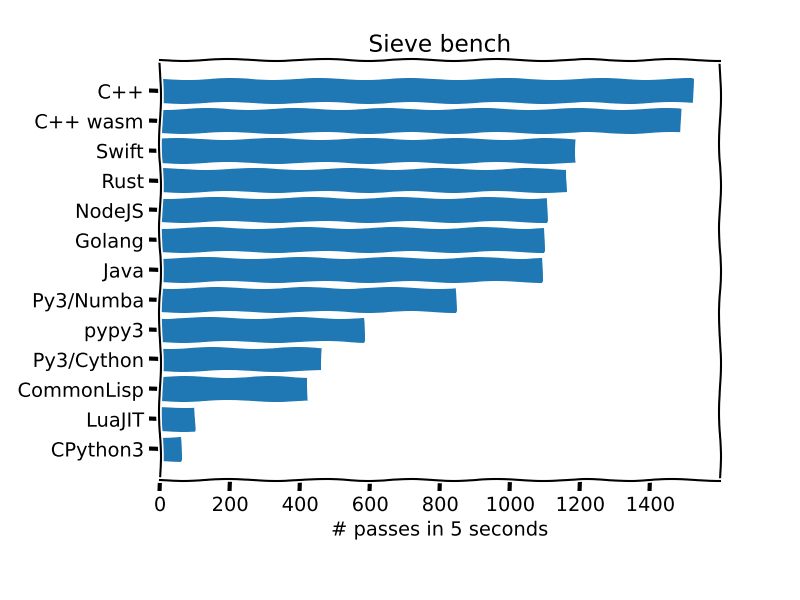

# Sieve Bench

## _A biased and unscientific language performance benchmark for fun_

The [idea](https://www.youtube.com/watch?v=D3h62rgewZM) is to implement the [Sieve of Eratosthenes](https://en.wikipedia.org/wiki/Sieve_of_Eratosthenes) in a bunch of different languages (using only the standard library, without concurrency or parallelism) and measure the number of passes each sieve can run for `size = 1000000` in 5 seconds. This repo runs all implementations automatically in CI (Github Actions) and generates the plot below.



## Contribute

You're welcome to contribute an implementation for a new language or improve an existing implementation (my implementations are probably whack :P). The function `sieve` should take argument `size` of type `int` and returns a list of all prime numbers up to (and not including) size.

For a new language implementation:

### 1. Create a new directory in the root of the repo with the name of the language (e.g. `rust`) and place your source code inside.

- The source code must check the implementation against the [truth file](https://github.com/kwsp/sieve/blob/main/truth.txt).
- `sieve(1000000)` should be executed as many times as possible within 5 seconds in a timer loop.
- The only output to your program should be the number of passes `sieve(1000000)` ran for.

### 2. Create an executable script named `run.sh`

This is so the driver program knows how to run your code and can automatically parse its output to generate the plot.

- Compile your source code and run it to print the number of passes (first line)
- Print the name of the language (second line)
- Print the version of the runtime/compiler (every consecutive line after)

For example, the `run.sh` output for the Java implementation is shown below. The first line shows the number of passes, the second line is the name of the language and everything else is just the output to `java --version`

```
1929
Java
openjdk 11.0.11-ea 2021-04-20
OpenJDK Runtime Environment (build 11.0.11-ea+4-post-Debian-1)
OpenJDK 64-Bit Server VM (build 11.0.11-ea+4-post-Debian-1, mixed mode, sharing)
```

### 3. Specify language dependencies

- The CI runs the latest Ubuntu, so find your language dependencies in `apt` and edit `scripts/install_dependencies.sh` to add them.
